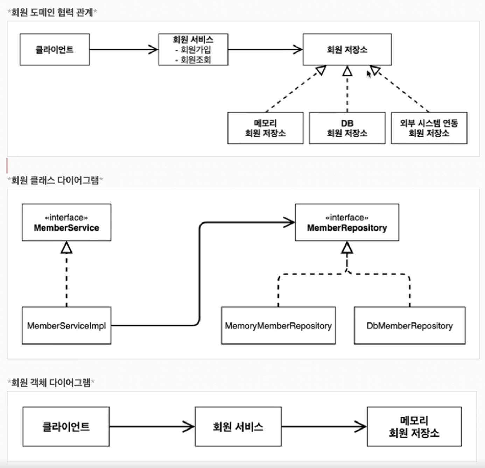

# Section 02
# 예제 학습

# 비즈니스 요구사항과 설계

### 회원 도메인 요구사항

- 회원은 가입하고 조회할 수 있다.
- 회원은 일반과 VIP 두 가지 등급이 있다.
- 회원 데이터는 자체 DB를 구축할 수 있고, 외부 시스템과 연동할 수 있다


회원 서비스 : MemberServiceImpl

클래스 다이어그램은 정적, 객체 다이어그램은 동적

- new를 해봐야 알 수 있기 때문

~ 코드를 작성함 ~

의심해봐야 할 점

- 지금 작성한 코드들이 OCP / DIP 원칙을 잘 지키고 있을까?
- 의존 관계가 인터페이스 뿐만아니라 구현까지 모두 의존하고 있음

```java
public class MemberServiceImpl implements MemberService {

    private final MemberRepository memberRepository = new MemoryMemberRepository();
}
```

MemberServiceImpl이 MemberRepository(인터페이스)와 MemoryMemberRepository(구현체)를 모두 의존하고 있다. 추상화와 구체화에 모두 의존한다(DIP 위반).

# Section 03

```java
public class OrderServiceImple implements OrderService {
	
	//private final DiscountPolicy discountPolicy = new FixDiscountPolicy();
	private final DiscountPolicy discountPolicy = new RateDiscountPolicy();
	
}
```

얘도 마찬가지로 OCP / DIP를 충실히 지키지 않았다.

DIP : 추상 클래스 의존 - DiscountPolicy / 구현 클래스 의존 - FixDiscountPolicy, RateDiscountPolicy

현 코드에서 기능을 확장해서 변경한다면 클라이언트 코드에 영향을 준다. 따라서 OCP를 위반한다.

## 관심사의 분리

객체는 자신의 역할을 수행하는 것에만 집중해야 한다. 역할(책임)을 확실히 분리하자.

### AppConfig 등장

애플리케이션 전체 동작 방식을 구성하기 위해 **구현 객체를 생성하고 연결**하는 책임을 가지는 별도의 설정 클래스

```java
public class AppConfig {
    public MemberService memberService(){
        return new MemberServiceImpl(new MemoryMemberRepository());
    }
}

public class MemberServiceImpl implements MemberService {
    private final MemberRepository memberRepository;

    public MemberServiceImpl(MemberRepository memberRepository) {
        this.memberRepository = memberRepository;
    }

    @Override
    public void save(Member member) {
        memberRepository.save(member);
    }
}

public class Main {
    public static void main(String[] args) {
        AppConfig appConfig = new AppConfig();
        MemberService memberService = appConfig.memberService();
        memberService.save(new Member(1L, "memberA"));
    }
}
```

AppConfig에서 MemberRepository를 주입해주기 때문에 의존을 제외하고 동작하도록 작성할 수 있다.

외부에서 MemberServiceImpl에 의존성을 주입(Dependency Injection)해주는 것!

```java
public class AppConfig {
    public MemberService memberService(){
        return new MemberServiceImpl(memberRepository());
    }

    private MemberRepository memberRepository() {
        return new MemoryMemberRepository();
    }
}
```

위 코드와 같이 AppConfig를 리팩토링할 수 있다.

메서드명만 읽고 어떤 역할을 하는지, 어떤 요소가 있는지 직관적으로 알아볼 수 있다.

다만 만약 AppConfig에서 변경이 발생한다면 다른 코드에도 변경 소요가 발생할 수 있기에 확인이 필요하다.

## IoC / DI / 컨테이너

AppConfig와 같이 객체의 생성, 관리로 의존관계를 연결해주는 것을 IoC 컨테이너 또는 DI 컨테이너라고 한다. 일반적으로 DI 컨테이너라고 부른다.

### IoC란?

- 제어의 역전
- 구현 객체 스스로 필요한 객체를 선택하는 건 자연스럽다.
- 그렇지만 AppConfig에서 객체 선택과 같은 제어의 흐름을 가져가게 되면 구현 객체는 무엇이 주입되는 지 모르고 객체를 사용하게 된다.
- 구현 객체 자신이 스스로 제어하는 것이 아닌 외부에서 제어하는 것을 IoC라고 한다.

### DI

- 의존관계 주입(Dependency Injection)
- 정적 클래스 의존관계 / 동적 객체(인스턴스) 의존 관계로 분리해서 이해해야 함
- 정적 클래스 의존관계 : import와 같이 MemberRepository에 대해 알고 있는 것
- 동적 객체 의존관계 : Runtime에 생성된 객체 인스턴스의 참조가 연결된 의존관계
- 외부에서 구현 객체를 생성하고 클라이언트에 주입한다면 그것이 의존관계 주입

## Spring으로 전환하기

```java
@Configuration
public class AppConfig {
    
    @Bean
    public MemberService memberService(){
        return new MemberServiceImpl(memberRepository());
    }

    @Bean
    private static MemoryMemberRepository memberRepository() {
        return new MemoryMemberRepository();
    }
}
```

Spring에서 @Configuration 어노테이션을 추가하여 AppConfig를 구성 정보로 사용하도록 할 수 있다.

@Bean 어노테이션을 붙인 메서드를 모두 호출하고, 반환된 객체(Spring Bean)를 Spring 컨테이너에 등록한다.

이때 메서드명이 Spring Bean의 이름이다.

```java
public class Main {
    public static void main(String[] args) {
        //기존 코드
        //AppConfig appConfig = new AppConfig();
        //MemberService memberService = appConfig.memberService();

        //수정 코드
        ApplicationContext applicationContext = new AnnotationConfigApplicationContext(AppConfig.class);
        MemberService memberService = applicationContext.getBean("memberService", MemberService.class);

        memberService.save(new Member(1L, "memberA"));
    }
}
```

자바 코드 기반의 스프링 컨테이너인 AnnotationConfigApplicationContext로 ApplicationContext를 구성한다.

스프링 컨테이너인 ApplicationContext에서 getBean() 메서드를 통해 Spring Bean을 찾을 수 있다.