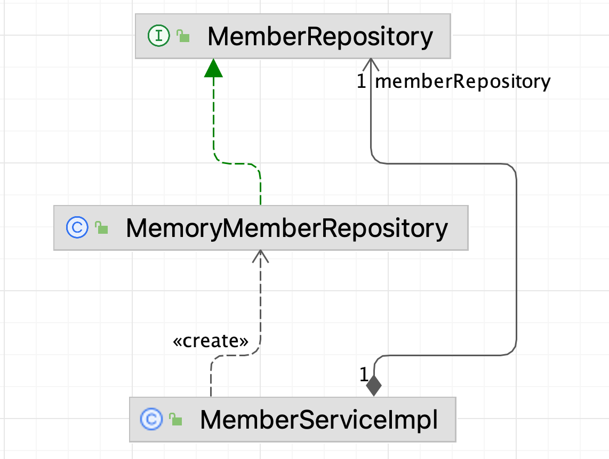

# 2, 3장 정리

## 배경


### 이 코드에는 어떤 문제가 있을까?

```java
public class MemberServiceImpl implements MemberService {
	
    private final MemberRepository memberRepository = new MemoryMemberRepository();
    ..
}	
```

- 이 코드 자체만 보면, 역할과 구현이 분리되어 있고 다형성을 활용하고 있다.
- 하지만, 이 코드는 SRP, OCP, DIP 를 위반하고 있다.

### SOLID의 위반



- `MemberServiceImpl` 은, `MemberRepository` 를 이용하는 것 뿐만 아니라, 이에 대한 **구현 객체를 생성하고 연결**하는 책임도 가지고 있기에, **SRP**를 위반한다.
- 또한, `MemberRepository` 를 다른 구체 클래스로 변경할 때 `MemberServiceImpl` 의 코드도 변경해야 한다. 즉, 기능의 변경이 클라이언트 코드에 영향을 주고 있기에, **OCP를 위반**한다.
- `MemberServiceImpl`의 **클래스 다이어그램**을 보면, 인터페이스인 `MemberRepository` 에 의존하고 있긴 하지만, 동시에 구체 클래스인 `MemoryMemberRepository` 에도 의존하고 있기에, **DIP를 위반**한다.

### 해결 : 인터페이스에만 의존하도록 수정한다.

```java
public class MemberServiceImpl implements MemberService {
	
	private MemberRepository memberRepository;
	..
}
```

- 위와 같이 수정하면, `MemberServiceImpl`은 인터페이스인 `MemberRepository` 에만 의존하게 되어, 기존의 구체 클래스에 의존하던 문제가 해결된다.
- 하지만, `memberRepository` 를 사용하려고 하면 어떻게 될까? → 인스턴스가 없기에 **NPE가 발생**한다.

### 관심사의 분리

- 애플리케이션을 하나의 공연이라고 생각하자.
- 그러면 위의 경우에서, `MemberRepository` 는 **배역**이고, `MemoryMemberRepository` 는 **배우**라고 생각할 수 있다.
- 기존의 코드에선, **배역이 배우의 영향을 받는 상황이 발생**했었다.
- 어떻게 해야할까? → 배역은 배역대로 두고, **배우를 지정해주는** **기획자**가 필요하다.

### AppConfig

- 애플리케이션의 전체 동작 방식을 구성하기 위해, **구현 객체를 생성하고 연결하는 책임**을 가지는 별도의 클래스를 만든다.

1. `MemberServiceImpl`의 수정

```java
public class MemberServiceImpl implements MemberService {
	
	private final MemberRepository memberRepository;
	
	public MemberServiceImpl(MemberRepository memberRepository) {
		this.memberRepository = memberRepository;
	}
}
```

- `MemberServiceImpl` 이라는 클라이언트 코드가, `MemberService`라는 **역할**에만 의존하도록 수정한다.
- 그 역할에 대한 **구현**은 **외부에서 생성자를 통해 지정**하도록 수정한다.

2. `AppConfig` 정의

```java
public class AppConfig {
	
	public MemberService memberService() {
		return new MemberServiceImpl(new MemoryMemberRepository());
	}
}
```

- AppConfig는 애플리케이션의 동작에 필요한 **구현 객체를 생성**한다.
- 생성한 객체 인스턴스의 참조를 **생성자를 통해 주입**해준다.
    - 즉, `MemberServiceImpl` 의 생성에 필요한 `MemoryMemberRepository` 의 인스턴스를 생성자를 통해 주입한다.

### AppConfig의 정의에 의한 결과

```java
public class MemberServiceImpl implements MemberService {
	
	private final MemberRepository memberRepository;
	
	public MemberServiceImpl(MemberRepository memberRepository) {
		this.memberRepository = memberRepository;
	}
}
```

- `MemberRepository` 의 구체 클래스 생성과 연결을 `AppConfig`가 담당함으로써 `MemberServiceImpl`은 이를 실행하는 책임만을 가지게 되어 **SRP**를 지키게 된다.
- `MemberServiceImpl`은 역할, 즉 추상 타입인 `MemberRepository` 에만 의존하게 되어 **DIP**를 지키게 된다.
- `MemberRepository` 를 변경할 때 `AppConfig` 만 변경하면 되므로, 기능을 확장하게 되어도 `MemberServiceImpl` 의 코드는 변경하지 않아도 되기에 **OCP**를 지키게 된다.

### 현재의 AppConfig에서의 문제는 없을까?

```java
public class AppConfig {
	
	public MemberService memberService() {
		return new MemberServiceImpl(new MemoryMemberRepository());
	}
}
```

- AppConfig라는 구성 클래스도, **역할과 구현으로 분리**하는 것이 필요하다.
- 하지만, `memberService()` 를 보면, `MemberService`라는 역할과 `MemberServiceImpl`이라는 구현은 분리가 되어있으나,   
  `new MemoryMemberRepository()` 가 의미하는 바를 한눈에 알기 힘들다.

```java
public class AppConfig {
	
	public MemberService memberService() {
		return new MemberServiceImpl(memberRepository());
	}
	
	public MemberRepository memberRepository() {
		return new MemoryMemberRepository();
	}
}
```

- `MemberRepository` 라는 역할과, `MemoryMemberRepository` 라는 구현으로 한번 더 분리해서 이를 해결한다.

### 주의 : AppConfig를 사용하는 곳을 확인한다.

```java
class MemberServiceTest {
	
	MemberRepository memberRepository = new MemoryMemberRepository();
	MemberService memberService = new MemberServiceImpl(memberRepository());
}
```

- 위의 코드는, AppConfig를 사용함으로써 다음과 같이 수정될 수 있다.

```java
class MemberServiceTest {
	
	MemberService memberService;
	
	@BeforeEach
	void setUp() {
		AppConfig appConfig = new AppConfig();
		memberService = appConfig.memberService();
	}
}
```

- 기존의 `MemberServiceTest` 에 `MemoryMemberRepository` 를 이용한 테스트가 있고,   
  AppConfig에서 `MemoryMemberRepository`  대신 다른 `MemberRepository` 의 구체 클래스를 사용하도록 수정한다면?
    - 기존의 테스트가 실패할 수 있게 된다.
- 따라서, `AppConfig`를 사용한다면, AppConfig의 변경이 있을 때 이를 사용하는 다른 클래스의 코드도 한번 더 확인하자.


## IoC, DI, 컨테이너


### 제어의 역전(Inversion of Control, IoC)

- AppConfig 를 정의한 뒤로, AppConfig에 정의된 객체는 **자신의 기능을 실행하는 역할만 담당**한다.
- 즉, 프로그램의 제어 흐름을 각 객체가 관리하는 것이 아니라, AppConfig라는 **외부에서 관리**하고 있다.
- 이와 같이 **프로그램의 제어 흐름을 외부에서 관리**하는 것을 **제어의 역전(IoC)** 라고 한다.

### 클래스 의존 관계 vs 인스턴스 의존 관계

- 의존 관계는 `정적인 클래스 의존 관계`와 `동적인 인스턴스 의존 관계` 를 분리해서 생각한다.

```java
public class MemberServiceImpl implements MemberService {
	
    private final MemberRepository memberRepository;
    
    public MemberServiceImpl(MemberRepository memberRepository) {
        this.memberRepository = memberRepository;
    }
}
```

- 이 코드를 보면, `MemberServiceImpl`은 `MemberRepository` 에 의존하고 있다. → **클래스 의존 관계**
- 하지만, 클래스 의존 관계 만으로는 실제 어떤 `MemberRepository` 객체가 `MemberServiceImpl` 에 주입 되는지 알 수 없다.

```java
public static void main(String[] args) {
    MemberRepository memberRepository = new MemoryMemberRepository();
    MemberService memberService = new MemberServiceImpl(memberRepository);
}
```

- 위의 코드에선, `main()`에서 애플리케이션이 실행될 때 `MemberServiceImpl` 은 생성된 `MemoryMemberRepository` 인스턴스에 의존하고 있다.
- 위와 같이, `실행 시점에 실제 생성된 인스턴스에 대한 의존 관계`를 **동적인 인스턴스 의존 관계**라고 한다.

### 의존관계 주입(Dependency Injection, DI)

- 애플리케이션 **실행 시점(런타임)** 에 **외부에서 실제 구현 객체를 생성**하고, 클라이언트에 전달해서 **클라이언트와의 실제 의존 관계가 연결되는 것**을 **의존관계 주입** 이라고 한다.
- **클라이언트 코드를 변경하지 않고, 클라이언트가 사용하는 대상의 타입 인스턴스를 변경**할 수 있다.
- 즉, **정적인 클래스 의존관계를 변경하지 않고 동적인 인스턴스 의존관계를 쉽게 변경**할 수 있다.

### IoC, DI 컨테이너

- `AppConfig` 와 같이 **객체를 생성하고 관리하면서 의존관계를 연결**해 주는 것을 **IoC 컨테이너 또는 DI 컨테이너**라고 한다.
    - 주로 DI 컨테이너 라고 한다.

## 스프링 컨테이너 사용하기

기존에 정의한 자바 코드 기반의 `AppConfig` 를 스프링 기반으로 변경한다.

```java
@Configuration
public class AppConfig {

  @Bean
  public MemberService memberService() {
      return new MemberServiceImpl(memberRepository());
  }

  @Bean
  public MemberRepository memberRepository() {
      return new MemoryMemberRepository();
  }
}
```

### @Configuration

- 스프링 컨테이너는 `@Configuration`  어노테이션이 붙은 AppConfig를 설정(구성) 정보로 사용한다.
- `@Bean`  어노테이션이 붙은 메서드를 모두 호출한 뒤, 반환된 객체를 스프링 컨테이너에 등록한다.
    - 이렇게 **스프링 컨테이너에 등록된 객체**를 **`스프링 빈`** 이라고 한다.

### 사용

```java
// 기존
AppConfig appConfig = new AppConfig();
MemberService memberService = appConfig.memberService();

// 스프링 적용 뒤
ApplicationContext ac = new AnnotationConfigApplicationContext(AppConfig.class);
MemberService memberService = ac.getBean("memberService", MemberService.class);
```

- `ApplicationContext` 를 스프링 컨테이너라고 한다.
- `AnnotationConfigApplicationContext` 는 자바 코드 기반의 스프링 컨테이너이다.
- `getBean()` 을 통해 해당되는 스프링 빈을 얻을 수 있다.

### 결론

- 아직까지는 코드만 복잡해진 것 같고, 별도의 장점이 느껴지진 않는다.
- 다음 장부터는, **스프링 컨테이너를 정의했을 때의 장점** 을 알아가는 것을 목표로 하자!